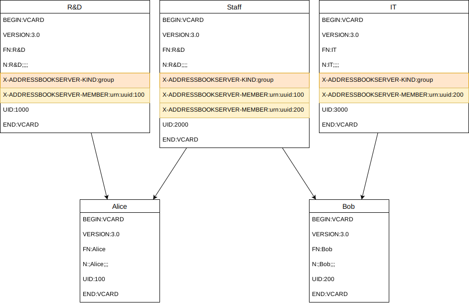
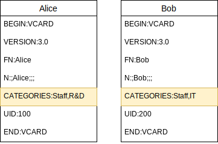

# Contact groups and how RCMCardDAV handles them

CardDAV ([RFC 6352](https://tools.ietf.org/html/rfc6352)) uses the vCard format for the contained address objects. There
is different versions of the vCard format:
 - Version 3 ([RFC 2426](https://tools.ietf.org/html/rfc2426))
 - Version 4 ([RFC 6350](https://tools.ietf.org/html/rfc6350))

Version 3 is the format that RFC 6352 requires every CardDAV server to support. Unfortunately, vCard v3 does not include
a specification of contact groups, whereas vCard v4 does. As a result, different implementations of contact groups have
developed over time, which causes interoperability issues with respect to the handling of contact groups across CardDAV
clients that have differing ideas on how to represent contact groups in the address objects (vCards) stored on the
CardDAV server.

This document describes the types of groups that exist and how RCMCardDAV handles them.

## Quick summary for users

- Both types of groups will be displayed in roundcube and can be edited with syncing back to the server
- The addressbook setting to select the group type only affects the type of groups _newly created_ in roundcube
- VCard-type groups are mostly used by Apple (macOS and iOS addressbook applications)
- CATEGORIES-type groups appear to be predominant otherwise

## Types of contact groups

Because of the lack of specification of contact groups in vCard v3, different implementations have developed.
Essentially, two variants can be observed, which I will refer to as _VCard-type groups_ and _CATEGORIES-type groups_.

### VCard-type groups

With this variant, contact groups are stored as first-class address objects on the CardDAV server, each being a separate
vCard. It appears this variant was originally developed by Apple, as it uses vCard properties with the
`X-ADDRESSBOOKSERVER` prefix. The vCards are marked as groups by the `X-ADDRESSBOOKSERVER-KIND` property with the value
_group_. The member contacts are referenced from within the group vCard by `X-ADDRESSBOOKSERVER-MEMBER` properties that
reference the member contacts by their vCards' UID values.

This type of group implementation is particularly used by Apple applications (macOS and iOS addressbooks) and services
(iCloud).

vCard v4 specifies precisely this approach as the way to implement contact groups, except for using different property
names (without the `X-ADDRESSBOOKSERVER` prefix, i.e. `KIND` and `MEMBER`). RCMCardDAV does not currently support the
vCard v4 property names, it uses the vCard v3 extension properties described before.

### CATEGORIES-type groups

This type of group implementation uses the `CATEGORIES` vCard property to store the groups a contact belongs to directly
with the corresponding contact vCard.

This is a standard property of vCard v3, with the following purpose stated by
[RFC 2426](https://tools.ietf.org/html/rfc2426):
> Purpose: To specify application category information about the vCard, also known as "tags".

This type of group implementation seems to be pre-dominant in the Linux and Android ecosystem. For example,
Owncloud/Nextcloud use it.

### Comparison of the two types

From the two the different structural approaches, it becomes clear the most operations performed on contact groups
require entirely different steps. A notable caveat of the CATEGORIES-type groups is the inability to store empty contact
groups on a CardDAV server. A group ceases to exist on the server when no contact includes it in its `CATEGORIES`
property anymore.

Another notable difference is what cards need to be touched to perform operations affecting a group:

- Deleting/Renaming a group: All contacts' vCards belonging to a CATEGORIES-type group need to be adapted to
  delete/rename the group. For a vCard-type group, only the group's vCard needs to be deleted/updated.
- Changes to group memberships: Adding or removing members from groups only requires changes to the group's vCard for a
  vCard-type group. For a CATEGORIES-type group, all affected members' vCards need to be updated.

## Handling by RCMCardDAV

Originally, RCMCardDAV supported vCard-type groups only. CATEGORIES-type groups were contributed later, and the user had
to choose the group type upon creation of the addressbook. Groups of the other type would be ignored, and the choice
could not be changed later without recreating the addressbook. A drawback with this approach is that most user's will
not be aware of the differences between the two group types and which type they are using. Such this choice is difficult
to make for most users and causes confusion.

As of version 4, RCMCardDAV will display both types of contacts groups from contacts received from the server. Changes
to the groups will carry out the necessary operations for the respective type of the group. However, when creating a new
group from within roundcube, RCMCardDAV does not know which type of group it should use. For this single operation, the
configuration switch still exists, but it can now be changed at any time.

### Behavior for empty CATEGORIES-type groups

Empty CATEGORIES-type groups cannot be stored on the server. This brings up the issue, on how to treat empty
CATEGORIES-type groups from within RCMCardDAV. A core concept of RCMCardDAV is that its database is a cache only as far
as the address data is concerned, the CardDAV server is authoritative with respect to address data. Therefore, the
normal approach to change address data from roundcube will perform the modification on the server only, and then sync it
back to the local database (cache) by means of a regular sync operation. This does not work work CATEGORIES-type groups
when a new group of that type is created from within roundcube. At the time of creation, the group is empty and can thus
not be stored on the server. It must be stored in the local database. On the other hand, it seems beneficial to
automatically remove empty groups as they cease to exist on the server, otherwise rename and delete operations of
CATEGORIES-type groups made by other clients would always leave empty group records in the database to be manually
cleaned up by the user.

The following design was chosen for RCMCardDAV:
- When a new CATEGORIES-type group is created, it is stored as an empty group in the local database. As long a no member
  is added either from roundcube, or incoming by sync with a CATEGORIES-type group of that name, it will exist as an
  empty group and not be deleted.
- When a group becomes empty during a sync operation (i.e. it was not empty before the sync, but all its members were
  removed during the sync), the group is also deleted from the local database (cache). This allows rename and delete
  operations on groups made by other clients to sync automatically.
- When a CATEGORIES-type group was empty before the sync, and still is after the sync, it is _not_ deleted from the
  database.
